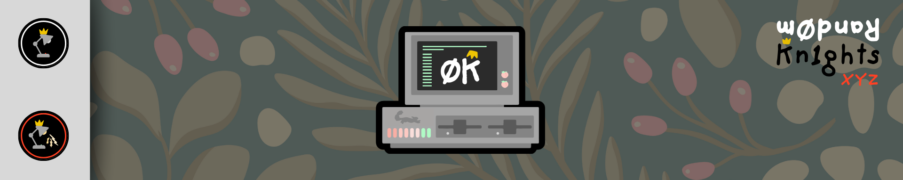
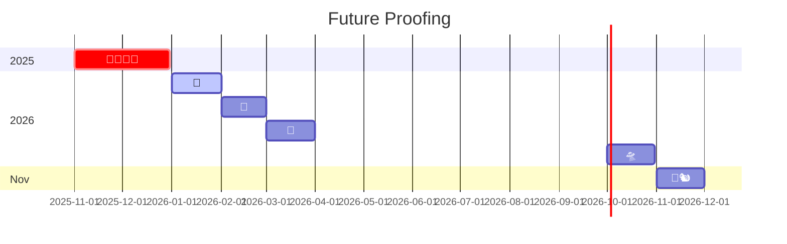
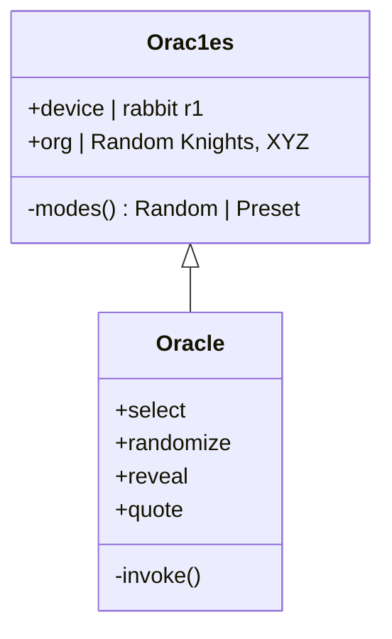

**<h1>Rand0m Orac1es /// Random Knights, XYZ</h1>**

  

## <u> **SUMMARY** </u>

**0rac1es** &nbsp;`Words from the Rand0mly Wise` &nbsp;— a standalone crystal&#8209;ball oracle **Creation for the rabbit r1**.
 
<small>from Random Knights, XYZ &middot;</small>

Shake the r1, press the side button, or tap the screen and the crystal ball clears to reveal a random quote from one of fourteen oracles. Spin the scroll wheel (or swipe) to wander the carousel.

- Built with
  - Vanilla JS / HTML5 / CSS (no framework, no build step)
  - rabbit r1 Creations SDK (accelerometer &middot; scroll wheel &middot; side button)
  - Maximum Effort
  - Canva & Adobe Illustrator
  - Randomly.Engineering @ Rand0m.AI
  - :flying_saucer: Roswell, GA :peach:

## <u> **POINTS OF CONTACT** </u>

If any issues arise, please draft a strongly worded email and never send it to: **admin@rand0m.ai**

## <u> **THE ORACLES** </u>

`0rac1e` &nbsp;_(the random one &mdash; channels any of them)_ &middot; The Dude &middot; Ron Burgundy &middot; Bob Ross &middot; Leslie Knope &middot; Dwight Schrute &middot; Rick Sanchez &middot; Yoda &middot; Moira Rose &middot; Hermione Granger &middot; Taco Jesus &middot; Randy Marsh &middot; Linda Belcher &middot; Gandalf

## <u> **CONTROLS** </u>

| Gesture | Action | :crystal_ball: |
| ------- | ------ | :------------: |
| Shake the r1     | Reveal a quote      |
| Side button      | Reveal / next quote |
| Tap the orb      | Reveal a quote      |
| Scroll wheel / swipe | Change oracle   |

After ~8s of stillness the quote fades and the crystal ball animates again. (For browser testing, the spacebar stands in for the side button.)

  

(<a href="#readme-top">back to top</a>)

## <u> **RUN IT** </u>

It's a plain static web app &mdash; nothing to build.

- **Locally:** open `apps/app/dist/index.html` in any browser.
- **Hosted (GitHub Pages):** every push to `main` auto&#8209;deploys `apps/app/dist/` via the included Actions workflow &rarr; **https://random-knights.github.io/r1-01/**
- **On the rabbit r1:** load that URL as a custom creation ("bring your own host"). Hardware shake/scroll/side&#8209;button fire only on the device.

## <u> **CORE SOLUTIONS** </u>

| Stack    | Spec | :chipmunk: |
| -------- | :--: | :--------: |
| Runtime  | rabbit r1 webview (240&times;282) |
| App      | HTML5 &middot; ES modules &middot; CSS |
| Hardware | accelerometer (shake) &middot; scroll &middot; side button |
| Host     | GitHub Pages (Actions) |

(<a href="#readme-top">back to top</a>)

<!-- RABBIT HOLE -->

## <u> **ENTER THE RABBIT HOLE** </u>

The objective of my work is to implement agentic frameworks to help the 🌎, keep personal data private and secure, give users more personalized customization and control, and to NEVER value profit/power over the product. Open-source and FREE for ALL.

- **GitHub Source Control** &mdash; version control + collaborative development.
- **GitHub Actions CI/CD** &mdash; the included Pages workflow builds + publishes the creation on every push to `main`.
- **No tracking, no accounts, no AI** &mdash; quotes are 100% static and bundled; nothing leaves the device.

[![ForScience][ForScience]][ForScience-url]
[![ForDevs][ForDevs]][ForDevs-url]

(<a href="#readme-top">back to top</a>)

<!-- ROADMAP -->

## <u> **ROADMAP** </u>

<!-- ORACLES -->

## <u> **ORACLES** </u>

<!-- CONTRIBUTING -->

## <u> **CONTRIBUTING** </u>

If you have a suggestion that would make this better, fork the repo and open a pull request &mdash; or open an issue with the tag "enhancement". Don't forget to star the project!

1. Fork the Project
2. Create your Feature Branch (`git checkout -b feature/AmazingFeature`)
3. Commit your Changes (`git commit -m 'Add some AmazingFeature'`)
4. Push to the Branch (`git push origin feature/AmazingFeature`)
5. Open a Pull Request

[Rand0m Kn1ghts - Discord](https://discord.gg/GK2Us54mzd) &middot; [Random Knights, XYZ - GitHub](https://github.com/random-knights)

(<a href="#readme-top">back to top</a>)

## <u> **CREDITS** </u>

Character quotes are short parody/fair-use references to their respective works, for entertainment. Crystal-ball art & animations by Random Knights, XYZ. **Random Knights, XYZ** fully supports the consumption of tacos :taco::taco::taco: &mdash; use at your own discretion, and listen to your tum tum.

### **Built with**

[![JavaScript][JavaScript]][JavaScript-url]
[![GitHub][GitHub]][GitHub-url]
[![GitHubActions][GitHubActions]][GitHubActions-url]
[![Git][Git]][Git-url]
[![AdobeIllustrator][AdobeIllustrator]][Illustrator-url]
[![Canva][Canva]][Canva-url]

(<a href="#readme-top">back to top</a>)

<!-- MARKDOWN LINKS & IMAGES -->

[ForDevs]: https://forthebadge.com/images/badges/built-by-developers.svg
[ForDevs-url]: https://dev.to/
[ForScience]: https://forthebadge.com/images/badges/built-with-science.svg
[ForScience-url]: https://forthebadge.com
[JavaScript]: https://img.shields.io/badge/JavaScript-274727?style=for-the-badge&logo=javascript&logoColor=F7DF1E
[JavaScript-url]: https://www.javascript.com/
[GitHub]: https://img.shields.io/badge/GitHub-7A997A?style=for-the-badge&logo=github&logoColor=white
[GitHub-url]: https://github.com/random-knights/r1-01
[GitHubActions]: https://img.shields.io/badge/GitHub_Actions-2088FF?style=for-the-badge&logo=github-actions&logoColor=white
[GitHubActions-url]: https://github.com/features/actions
[Git]: https://img.shields.io/badge/GIT-7A997A?style=for-the-badge&logo=git&logoColor=white
[Git-url]: https://git-scm.com/
[AdobeIllustrator]: https://img.shields.io/badge/Adobe%20Illustrator-113011?style=for-the-badge&logo=adobe%20illustrator&logoColor=white
[Illustrator-url]: https://www.adobe.com/creativecloud/products/illustrator.html
[Canva]: https://img.shields.io/badge/Canva-113011.svg?&style=for-the-badge&logo=Canva&logoColor=white
[Canva-url]: https://canva.com

## Operating this repo

- [RUNBOOK.md](RUNBOOK.md) - humans: how it deploys (merging to main publishes
  the live site), roll back, what breaks and how to fix it.
- [AGENTS.md](AGENTS.md) - agents: the rules that apply in this repo.
